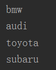
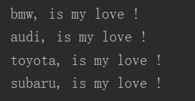

## 循环

#### 12 for循环

```python
# 遍历列表的所有元素
cars = ['bmw', 'audi', 'toyota', 'subaru']
for car in cars:
    print(car)
```




```python
cars = ['bmw', 'audi', 'toyota', 'subaru']
for car in cars:
    print(car + ", is my love !")
```




