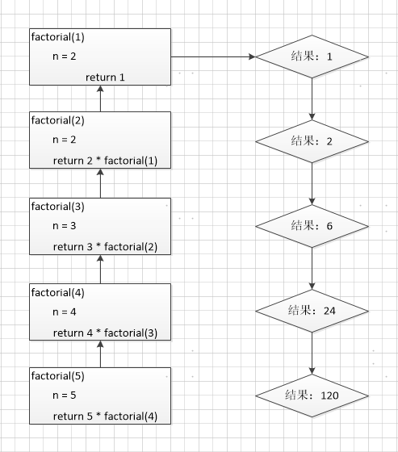

## `·文件操作

#### 1 文本文件和二进制文件

文本文件存储的是普通“字符”文本，python 默认为unicode 字符集（两个字节表示一个字符，最多可以表示：65536 个），可以使用记事本程序打开。

二进制文件把数据内容用“字节”进行存储，无法用记事本打开。必须使用专用的软件解码。常见的有：MP4 视频文件、MP3 音频文件、JPG 图片、doc 文档等等。


#### 2 创建文件对象

open()函数用于创建文件对象，基本语法格式：open(文件名[,打开方式])

如果只是文件名，代表在当前目录下的文件。文件名可以录入全路径。

| 模式 | 描述                                                         |
| ---- | ------------------------------------------------------------ |
| r    | 读read 模式                                                  |
| w    | 写write 模式。如果文件不存在则创建；如果文件存在，则重写新内容 |
| a    | 追加append 模式。如果文件不存在则创建；如果文件存在，则在文件末尾追加内容 |
| b    | 二进制binary 模式（可与其他模式组合使用）                    |


#### 3 文本写入

```python
f = open(r"a.txt","a")
s = "I love duoduo"
f.write(s)
f.close()
```

执行结果：

```
I love duoduo
```


常用编码

ASCII --> ISO8859-1 --> GB2312,GBK,GB18030

Unicode

UTF-8

windows 操作系统默认的编码是GBK，Linux 操作系统默认的编码是UTF-8。

```python
#指定编码
f = open(r"a.txt","w",encoding="utf-8")
s = "我是林一"
f.write(s)
f.close()
```


write(a)：把`字符串` 写入到文件中
writelines(b)：把`字符串列表`写入文件中，不添加换行符

```python
f = open(r"b.txt","w",encoding="utf-8")
s = ["林一\n","林二\n","林三\n"]
f.writelines(s)
f.close()
```

执行结果：

```
林一
林二
林三
```


关闭文件对象

```python
#结合异常机制finally 确保关闭文件对象
try:
    f = open(r"c.txt","a")
    str = "duoduo"
    f.write(str)
except BaseException as e:
    print(e)
finally:
    f.close()
```

```python
#使用with 管理文件写入操作
s = ["林一\n","林二\n","林三\n"]
with open(r"a.txt","w") as f:
    f.writelines(s)
```


#### 4 文本读取

- read([size])：从文件中读取size个字符，并作为结果返回。如果没有size 参数，则读取整个文件。读取到文件末尾，会返回空字符串。
- readline()：读取一行内容作为结果返回。读取到文件末尾，会返回空字符串。
- readlines()：文本文件中，每一行作为一个字符串存入列表中，返回该列表。


```python
#读取一个文件前4个字符
with open(r"bb.txt","r",encoding="uft-8") as f:
    print(f.read(4))
```

```python
#文件较小，一次将文件内容读入到程序中
with open(r"bb.txt","r",encoding="uft-8") as f:
    print(f.read())
```

```python
#按行读取一个文件
with open(r"jar.txt","r") as f:
    while True:
        s = f.readline()
        if not s:
            break
        else:
            print(s,end="")
```


#### 5 二进制文件读取和写入

```python
#读取图片文件，实现文件的拷贝
with open("a.gif","rb") as f:
    with open("aa.gif","wb") as w:
        for line in f.readlines():
            w.write(line)
print("图片拷贝完成")
```


#### 6 使用pickle 序列化

序列化指的是：将对象转化成“串行化”数据形式，存储到硬盘或通过网络传输到其他地方。

反序列化是指相反的过程，将读取到的“串行化数据”转化成对象。

序列化使用：

- pickle.dump(obj, file) obj 就是要被序列化的对象，file 指的是存储的文件
- pickle.load(file) 从file 读取数据，反序列化成对象

```python
#将对象序列化到文件中
import pickle
with open(r"1.log","wb") as f:
    a1 = "林一"
    a2 = 234
    a3 = [10,20,30]
    pickle.dump(a1,f)
    pickle.dump(a2,f)
    pickle.dump(a3,f)
```

```python
#将获得的数据反序列化成对象
import pickle
with open(r"1.log","rb") as f:
    a1 = pickle.load(f)
    a2 = pickle.load(f)
    a3 = pickle.load(f)
    print(a1)
    print(a2)
    print(a3)
```


#### 7 CSV 文件的操作

csv是逗号分隔符文本格式，常用于数据交换、Excel文件和数据库数据的导入和导出

```python
#csv.reader对象于从csv文件读取数据
import csv
with open(r"1.csv","r") as f:
    a_csv = csv.reader(f) #创建csv对象,它是一个包含所有数据的列表，每一行为一个元素
    headers = next(a_csv) #获得列表对象，包含标题行的信息
    print(headers)
    for row in a_csv:
        print(row)
```

```python
import csv
headers = ["工号","姓名","年龄","地址","月薪"]
rows = [("1001","高淇",18,"西三旗1 号院","50000"),("1002","高八",19,"西三旗1 号院","30000")]
with open(r"2.csv","w") as b:
    b_csv = csv.writer(b) #创建csv 对象
    b_csv.writerow(headers) #写入一行（标题）
    b_csv.writerows(rows) #写入多行（数据）
```


#### 8 OS模块

| 方法名                          | 描述                            |
| ------------------------------- | ------------------------------- |
| system()                        | 直接调用系统的命令              |
| remove(path)                    | 删除指定的文件                  |
| rename(src,dest)                | 重命名文件或目录                |
| stat(path) 返                   | 返回文件的所有属性              |
| listdir(path)                   | 返回path 目录下的文件和目录列表 |
| mkdir(path)                     | 创建目录                        |
| makedirs(path1/path2/path3/...) | 创建多级目录                    |
| rmdir(path)                     | 删除目录                        |
| removedirs(path1/path2...)      | 删除多级目录                    |
| getcwd()                        | 返回当前工作目录                |
| chdir(path)                     | 把path 设为当前工作目录         |
| walk()                          | 遍历目录树                      |
| sep                             | 当前操作系统所使用的路径分隔符  |


**1】os.system模块**

```python
import os
os.system("ls /tmp")
```


**2】os.path 模块**

| 方法               | 描述                           |
| ------------------ | ------------------------------ |
| isabs(path)        | 判断path是否绝对路径           |
| isdir(path)        | 判断path是否为目录             |
| isfile(path)       | 判断path是否为文件             |
| exists(path)       | 判断指定路径的文件是否存在     |
| getsize(filename)  | 返回文件的大小                 |
| abspath(path)      | 返回绝对路径                   |
| dirname(p)         | 返回目录的路径                 |
| getatime(filename) | 返回文件的最后访问时间         |
| getmtime(filename) | 返回文件的最后修改时间         |
| walk(top,func,arg) | 递归方式遍历目录               |
| join(path,*paths)  | 连接多个path                   |
| split(path)        | 对路径进行分割，以列表形式返回 |
| splitext(path)     | 从路径中分割文件的扩展名       |


**3】os.walk()**

```python
#使用walk()递归遍历所有文件和目录
import os
all_files = []
path = os.getcwd()
list_file = os.walk(path)

for dirpath,dirnames,filenames in list_file:
    for dir in dirnames:
        all_files.append(os.path.join(dirpath,dir))
    for name in dirnames:
        all_files.append(os.path.join(dirpath,name))

for file in all_files:
    print(file)
```


#### 9 shutil 模块

```python
#实现文件的拷贝
import shutil
shutil.copyfile("1.log","1_bak.log")
```


```python
#实现递归的拷贝文件夹内容，拷贝时忽略*.log文件
import shutil
shutil.copytree("E:/1","E:/2",ignore=shutil.ignore_patterns("*.log"))
```


```python
#文件夹压缩打包
import shutil
shutil.make_archive("E:/2/py","zip","E:/1")
```


```python
#多个文件压缩打包
import zipfile
z = zipfile.ZipFile("E:/2/a.zip","w")
z.write("E:/1/1.log")
z.write("E:/1/2.log")
z.close()
```


```python
#解压到指定目录
import zipfile
z = zipfile.ZipFile("E:/2/a.zip","r")
z.extractall("E:/3")
z.close()
```


#### 10 递归算法

递归的基本思想就是“自己调用自己”。

```python
#使用递归求n!
def factorial(n):
    if n == 1:
        return 1
    else:
        return n * factorial(n-1)
a = factorial(5)
print(a)
```



执行结果：

```
120
```


递归的缺陷：简单的程序是递归的优点之一。但是递归调用会占用大量的系统堆栈，内存耗用多，在递
归调用层次多时速度要比循环慢的多，所以在使用递归时要慎重。

