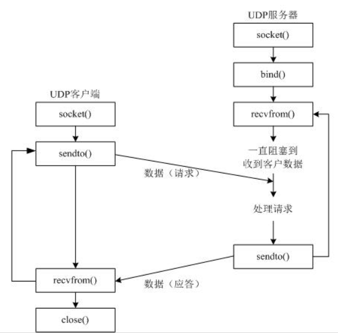
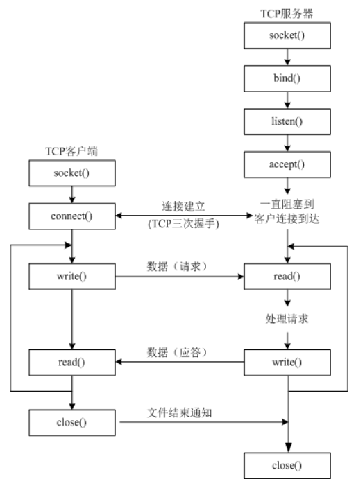

## UDP/TCP

### 1 socket

socket(套接字) 是进程间通信的一种方式，它能实现不同主机间的进程间通信，我们网络上各种各样的服务大多都是基于 Socket 来完成通信的。

1】创建socket

```python
import socket
socket.socket(AddressFamily, Type)
```

- Address Family：AF_INET（用于 Internet 进程间通信） 或者 AF_UNIX（用于同一台机器进程间通信）。
- Type：套接字类型， SOCK_STREAM（用于 TCP 协议）或者 SOCK_DGRAM（用于 UDP 协议）。

2】tcp socket

```python
import socket
s = socket.socket(socket.AF_INET, socket.SOCK_STREAM)	# 创建tcp socket
pass
s.close()
```

2】udp socket

```python
import socket
s = socket.socket(socket.AF_INET, socket.SOCK_DGRAM)	# 创建udp socket
pass
s.close()
```


### 2 udp网络程序

步骤：

- 创建客户端套接字
- 发送/接收数据
- 关闭套接字



```python
# 1 发送数据
from socket import *
udp_socket = socket(AF_INET, SOCK_DGRAM)    # 创建udp socket
dest_addr = ('192.168.1.103', 8080)  # 注意是元组，ip是字符串，端口是数字
send_data = input("请输入要发送的数据:")
udp_socket.sendto(send_data.encode('utf-8'), dest_addr) # 发送数据
udp_socket.close()  # 关闭udp socket
```


```python
# 2 发送、接收数据
from socket import *
udp_socket = socket(AF_INET, SOCK_DGRAM)
dest_addr = ('192.168.236.129', 8080)
send_data = input("请输入要发送的数据:")
udp_socket.sendto(send_data.encode('utf-8'), dest_addr)
recv_data = udp_socket.recvfrom(1024)  
# 1024表示本次接收的最大字节数
# 接收到的数据recv_data是一个元组
# 第1个元素是对方发送的数据
# 第2个元素是对方的ip和端口
print(recv_data[0].decode('gbk'))
print(recv_data[1])
udp_socket.close()
```


```python
# 3 upd绑定端口
from socket import *
udp_socket = socket(AF_INET, SOCK_DGRAM)
local_addr = ('', 7788) #  ip地址和端口号，ip一般不用写，表示本机的任何一个ip
udp_socket.bind(local_addr)     # upd绑定端口
recv_data = udp_socket.recvfrom(1024)
print(recv_data[0].decode('gbk'))
udp_socket.close()
```


### 3 udp聊天器

```python
import socket

def send_msg(udp_socket):
    """获取键盘数据，并将其发送给对方"""
    msg = input("\n请输入要发送的数据:")
    dest_ip = input("\n请输入对方的ip地址:")
    dest_port = int(input("\n请输入对方的port:"))
    udp_socket.sendto(msg.encode("utf-8"), (dest_ip, dest_port))

def recv_msg(udp_socket):
    """接收数据并显示"""
    recv_msg = udp_socket.recvfrom(1024)
    recv_ip = recv_msg[1]
    recv_msg = recv_msg[0].decode("utf-8")
    print(">>>%s:%s" % (str(recv_ip), recv_msg))

def main():
    udp_socket = socket.socket(socket.AF_INET, socket.SOCK_DGRAM)
    udp_socket.bind(("", 7890))
    while True:
        print("1:发送消息")
        print("2:接收消息")
        op_num = input("请输入要操作的功能序号:")
        if op_num == "1":
            send_msg(udp_socket)
        elif op_num == "2":
            recv_msg(udp_socket)
        else:
            print("输入有误，请重新输入...")

if __name__ == "__main__":
    main()
```


### 4 tcp网络程序




```python
# 1 tcp客户端
from socket import *
tcp_client_socket = socket(AF_INET, SOCK_STREAM)
server_ip = input("请输入服务器ip:")
server_port = int(input("请输入服务器port:"))
tcp_client_socket.connect((server_ip, server_port))     # 链接服务器
send_data = input("请输入要发送的数据：")
tcp_client_socket.send(send_data.encode("gbk"))     # 发送数据
recvData = tcp_client_socket.recv(1024)     # 接收数据
print('接收到的数据为:', recvData.decode('gbk'))
tcp_client_socket.close()
```


```python
# 2 tcp服务端
from socket import *
tcp_server_socket = socket(AF_INET, SOCK_STREAM)
address = ('', 7788)	# 绑定端口
tcp_server_socket.bind(address)
tcp_server_socket.listen(128)
client_socket, clientAddr = tcp_server_socket.accept()  # 创建新的套接字专门为客户端服务
recv_data = client_socket.recv(1024)    # 接收数据
print('接收到的数据为:', recv_data.decode('gbk'))
client_socket.send("thank you !".encode('gbk'))
client_socket.close()
```


```python
# 3 文件下载器服务端
from socket import *
import sys
def get_file_content(file_name):
    """获取文件的内容"""
    try:
        with open(file_name, "rb") as f:
            content = f.read()
        return content
    except:
        print("没有下载的文件:%s" % file_name)

def main():
    if len(sys.argv) != 2:
        print("请按照如下方式运行：python3 xxx.py 7890")
        return
    else:
        port = int(sys.argv[1])
    tcp_server_socket = socket(AF_INET, SOCK_STREAM)
    address = ('', port)
    tcp_server_socket.bind(address)
    tcp_server_socket.listen(128)
    while True:
        client_socket, clientAddr = tcp_server_socket.accept()
        recv_data = client_socket.recv(1024)
        file_name = recv_data.decode("utf-8")
        print("对方请求下载的文件名为:%s" % file_name)
        file_content = get_file_content(file_name)
        if file_content:
            client_socket.send(file_content)
        client_socket.close()
    tcp_server_socket.close()

if __name__ == "__main__":
    main()
```


```python
# 4 文件下载器客户端
from socket import *
def main():
    tcp_client_socket = socket(AF_INET, SOCK_STREAM)
    server_ip = input("请输入服务器ip:")
    server_port = int(input("请输入服务器port:"))
    tcp_client_socket.connect((server_ip, server_port))
    file_name = input("请输入要下载的文件名：")
    tcp_client_socket.send(file_name.encode("utf-8"))
    recv_data = tcp_client_socket.recv(1024)
    if recv_data:
        with open("[接收]"+file_name, "wb") as f:
            f.write(recv_data)
    tcp_client_socket.close()

if __name__ == "__main__":
    main()
```


### 5 TCP/IP协议


说明：

- 网际层也称为：网络层

- 网络接口层也称为：链路层