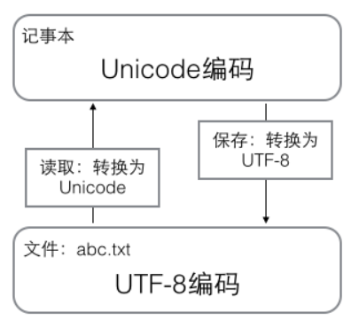
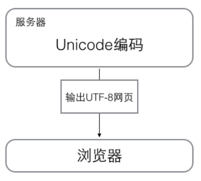

## Python基础

##### 1 Python的语法

```python
# print absolute value of an integer:
a = 100
if a >= 0:
    print(a)
else:
    print(-a)
```

以`#`开头的语句是注释，以冒号`:`结尾时，缩进的语句视为代码块。

注意：Python程序是大小写敏感的。


##### 2 数据类型

数据类型：整数，浮点数，字符串，布尔值，空值

转义字符`\`：`\n`表示换行，`\t`表示制表符，`\\`表示的字符就是`\`。

布尔值只有`True`、`False`两种值。

`None`是一个特殊的空值。


##### 3 变量

变量在计算机内存中的表示：

```python
a = 'ABC'
b = a
a = 'XYZ'
print(b)
```

- 执行`a = 'ABC'`，解释器创建了字符串`'ABC'`和变量`a`，并把`a`指向`'ABC'`；
- 执行`b = a`，解释器创建了变量`b`，并把`b`指向`a`指向的字符串`'ABC'`；
- 执行`a = 'XYZ'`，解释器创建了字符串'XYZ'，并把`a`的指向改为`'XYZ'`，但`b`并没有更改；
- 打印变量`b`的结果是`'ABC'`。


##### 4 常量

在Python中，通常用全部大写的变量名表示常量。


##### 5 字符编码

`ASCII`编码：1个字节（8 bit），只有127个字符，只有大小写英文字母、数字和一些符号。

Unicode编码：2个字节（16 bit），包含所有语言

`UTF-8`编码：把一个Unicode字符根据不同的数字大小编码成1-6个字节，常用的英文字母被编码成1个字节，汉字通常是3个字节，只有很生僻的字符才会被编码成4-6个字节。

| 字符 | ASCII    | Unicode           | UTF-8                      |
| :--- | :------- | :---------------- | :------------------------- |
| A    | 01000001 | 00000000 01000001 | 01000001                   |
| 中   | x        | 01001110 00101101 | 11100100 10111000 10101101 |

在计算机内存中，统一使用Unicode编码，当需要保存到硬盘或者需要传输的时候，就转换为UTF-8编码。

- 用记事本编辑的时候，从文件读取的UTF-8字符被转换为Unicode字符到内存里，编辑完成后，保存的时候再把Unicode转换为UTF-8保存到文件：



- 浏览网页的时候，服务器会把动态生成的Unicode内容转换为UTF-8再传输到浏览器：




##### 6 字符串

Python 3版本中，字符串是以Unicode编码的，Python的字符串支持多语言。

字符串类型是`str`。


源代码中包含中文的时候，在保存源代码时，需指定保存为UTF-8编码。

当Python解释器读取源代码时，为了让它按UTF-8编码读取，我们通常在文件开头写上这两行：

```python
#!/usr/bin/env python3
# -*- coding: utf-8 -*-
```

第一行注释是为了告诉Linux/OS X系统，这是一个Python可执行程序，Windows系统会忽略这个注释；

第二行注释是为了告诉Python解释器，按照UTF-8编码读取源代码，否则，你在源代码中写的中文输出可能会有乱码。


在Python中，采用的格式化方式和C语言是一致的，用`%`实现

常见的占位符有：

| 占位符 | 替换内容     |
| :----- | :----------- |
| %d     | 整数         |
| %f     | 浮点数       |
| %s     | 字符串       |
| %x     | 十六进制整数 |

其中，格式化整数和浮点数还可以指定是否补0和整数与小数的位数：

```python
>>> print('%2d-%02d' % (3, 1))
 3-01
>>> print('%.2f' % 3.1415926)
3.14
```


`ord()`函数获取字符的整数

```python
>>> ord('a')
97
```

`chr()`函数把编码转换为对应的字符

```python
>>> chr(120)
'x'
```

`len()`函数计算的是`str`的字符数

```python
>>> len('lin')
3
```


##### 7 列表list

Python内置的一种数据类型是列表：list

```python
>>> x = ['lin','wen','hai']
>>> x
['lin', 'wen', 'hai']
>>> x[0]
'lin'
>>> x[1]
'wen'
>>> x[2]
'hai'
>>> x[-1]
'hai'
```

第一个元素索引是`0`，最后一个元素索引是`-1`。

`append`：往list中追加元素到末尾。

```python
>>> x.append('love')
>>> x
['lin', 'wen', 'hai', 'love']
```

`pop`：删除list末尾的元素。

```python
>>> x.pop()
'love'
>>> x
['lin', 'wen', 'hai']
```

`pop(i)`：删除索引为`i`的元素。

```python
>>> x.pop(1)
'wen'
>>> x
['lin', 'hai']
```

把某个元素替换成别的元素，可以直接赋值给对应的索引位置。

```python
>>> x[1] = 'yu'
>>> x
['lin', 'yu', 'hai']
```

list里面的元素可包含不同的数据类型。

```python
L = ['Apple', 123, True]
```

lis里面的元素可以是另一个list。

```python
>>> s = ['python', 'java', ['asp', 'php'], 'scheme']
>>> len(s)
4
```

list中一个元素也没有，就是一个空的list，它的长度为0。

```python
>>> s = []
>>> len(s)
0
```


##### 8 元组tuple

tuple和list非常类似，但是tuple一旦初始化就不能修改。

```python
>>> b = ('xin','ling')
>>> b
('xin', 'ling')
```


##### 9 条件判断

```python
s = input('birth:')
birth = int(s)
if birth < 2000:
    print('00前')
else:
	print('00后')
```

`input()`返回的数据类型是`str`


##### 10 循环

1】for...in循环

```python
names = ['lin','wen','hai']
for name in names:
    print(name)
```

执行这段代码，会依次打印`names`的每一个元素。


计算1-10的整数之和

```python
sum = 0
for x in [1,2,3,4,5,6,7,8,9,10]:
    sum =sum + x
print(sum)
```

```python
sum = 0
for x in range(11):
    sum = sum + x
print(sum)
```

`range(11)`生成的序列是从0开始小于11的整数。


2】while循环

计算100以内偶数之和。

```python
sum = 0
n = 100
while n > 0:
    sum = sum + n
    n = n - 2
print(sum)
```


3】break语句

`break`的作用是提前结束循环。

```python
n = 1
while n <= 100:
    if n > 10:
        break
    print(n)
    n = n +1
print('END')
```


4】continue语句

`continue`语句，跳过当前的这次循环，直接开始下一次循环。

只打印奇数。

```python
n = 0
while n < 10:
    n = n + 1
    if n % 2 == 0:
        continue
    print(n)
```


##### 11 dict

Python内置了字典：dict的支持，dict全称dictionary，在其他语言中也称为map，使用键-值（key-value）存储，具有极快的查找速度。

```python
d = {'lin':1,'wen':2,'hai':3}
print(d['lin'])
```


##### 12 set

set和dict类似，也是一组key的集合，但不存储value。

```python
>>> s = set([1,2,3])
>>> s
{1, 2, 3}
>>> s = set ([1,1,2,2,3,3])		#在set中，没有重复的key
>>> s
{1, 2, 3}
>>> s.add(4)		#添加元素到set中
>>> s
{1, 2, 3, 4}
>>> s.remove(4)		#删除元素
>>> s
{1, 2, 3}
```

```python
>>> s1 = set([1,2,3])
>>> s2 = set([2,3,4])
>>> s1&s2		#交集
{2, 3}
>>> s1|s2		#并集
{1, 2, 3, 4}
```


