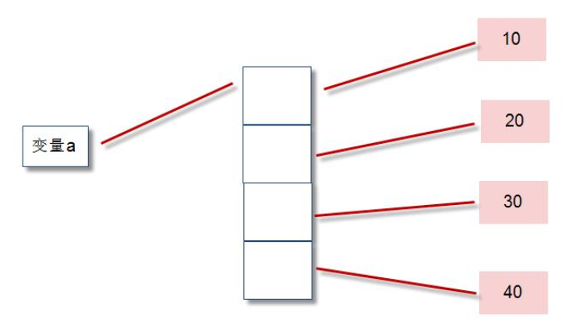

## 序列

序列是一种数据存储方式，用来存储一系列的数据。

在内存中，序列就是一块用来存放多个值的连续的内存空间。

序列a=[10,20,30,40]内存图：



python中常用的序列结构有：字符串、列表、元组、字典、集合。

### 1 列表（list）

列表：用于存储任意数目、任意类型的数据集合。

列表是内置可变序列，是包含多个元素的有序连续的内存空间。

| 列表常用方法         | 描述                                                         |
| -------------------- | ------------------------------------------------------------ |
| list.append(x)       | 将元素 x 增加到列表 list 尾部                                |
| list.extend(aList)   | 将列表 alist 所有元素加到列表 list 尾部                      |
| list.insert(index,x) | 在列表 list 指定位置 index 处插入元素 x                      |
| list.remove(x)       | 在列表 list 中删除首次出现的指定元素 x                       |
| list.pop([index])    | 删除并返回列表 list 指定为止 index 处的元素，默认是最后一个元素 |
| list.clear()         | 删除列表所有元素，并不是删除列表对象                         |
| list.index(x)        | 返回第一个 x 的索引位置，若不存在 x 元素抛出异常             |
| list.count(x)        | 返回指定元素 x 在列表 list 中出现的次数                      |
| len(list)            | 返回列表中包含元素的个数                                     |
| list.reverse()       | 所有元素原地翻转                                             |
| list.sort()          | 所有元素原地排序                                             |
| list.copy()          | 返回列表对象的浅拷贝                                         |

#### 1.1 创建列表

```python
>>> a=[10,20,30,40,50]
```

#### 1.2 list()方法

```python
>>> list()	#创建空列表
[]
>>> list(range(10))
[0, 1, 2, 3, 4, 5, 6, 7, 8, 9]
```

#### 1.3 推导式

```python
>>> a=[x**2 for x in range(5)]
>>> a
[0, 1, 4, 9, 16]
```

#### 1.4 append()方法

```python
>>> a=[10,20,30]
>>> a.append(40)	# 尾部追加元素
>>> a
[10, 20, 30, 40]
```

#### 1.5 extend()方法

```python
>>> a=[10,20]
>>> a.extend([50,60])	# 尾部追加列表
>>> a
[10, 20, 50, 60]
```

#### 1.6 insert()方法

```python
>>> a=[10,20,30]
>>> a.insert(1,100)		# 指定索引位置，增加元素
>>> a
[10, 100, 20, 30]
```

#### 1.7 del方法

```python
>>> a=[10,20,30]
>>> del a[1]	# 指定索引位置，删除元素
>>> a
[10, 30]
```

#### 1.8 pop()方法

```python
>>> a=[10,20,30]
>>> a.pop()		# 删除末尾元素，并返回删除元素
30
>>> a
[10, 20]

>>> b=[10,20,30]
>>> b.pop(1)	# 指定索引位置删除元素，并返回删除元素
20
>>> b
[10, 30]
```

#### 1.9 remove()方法

```python
>>> a=[10,20,30,40,20]
>>> a.remove(20)		# 指定元素值删除首次出现的元素，如需全部删除使用循环
>>> a
[10, 30, 40, 20]
```

#### 1.10 index()方法

```python
>>> a=[10,20,30,40]
>>> a.index(30)			# 指定元素值，返回索引位置
2
```

#### 1.11 count()方法

```python
>>> a=[10,20,30,40,90,30,70,30]
>>> a.count(30)		# 统计指定元素在列表出现的次数
3
```

#### 1.12 in方法

```python
>>> a=[10,20,30]
>>> 30 in a			# 判断元素是否在列表
True
```


#### 1.13 切片

语法：[start:end[:step]]  （包头不包尾）

a=[10,20,30,40,50]

| 示例     | 结果             | 描述                          |
| -------- | ---------------- | ----------------------------- |
| a[:]     | [10,20,30,40,50] | 提取整个列表                  |
| a[1:]    | [20,30,40,50]    | 从 索引1到 结尾               |
| a[:2]    | [10,20]          | 从索引0到索引2                |
| a[1:4:2] | [20, 40]         | 开始索引1，结尾索引4，步长为2 |

#### 1.14 列表遍历

```python
for obj in listObj:
print(obj)
```

#### 1.15 列表排序

1】修改原列表，不建新列表的排序

```python
>>> a=[10,30,50,40,20]
>>> a.sort()	# 升序排列，降序使用参数reverse=True
>>> a
[10, 20, 30, 40, 50]

>>> a.sort(reverse=True)
>>> a
[50, 40, 30, 20, 10]
```

```python
>>> import random
>>> a=[10,20,30,40,50]
>>> random.shuffle(a)		# 随机排列
>>> a
[20, 50, 30, 10, 40]
```

2】建新列表的排序，原列表不变

```python
>>> a=[20,10,50,40,30]
>>> sorted(a)			# 升序排列，降序使用参数reverse=True
[10, 20, 30, 40, 50]
>>> a
[20, 10, 50, 40, 30]
```

#### 1.16 多维列表

```python
a=[
    ["高小一",18,30000,"北京"],
    ["高小二",19,20000,"上海"],
    ["高小一",20,10000,"深圳"],
]
print(a[1][0],a[1][1],a[1][2])
```


### 2 元组（tuple）

列表属于可变序列，可以任意修改列表中的元素。

元组属于不可变序列，不能修改元组中的元素。

#### 2.1 tuple()方法

```python
>>> a=tuple()		# 创建空元组
>>> a
()

>>> b=tuple('abc')	# 分隔字符串创建元组
>>> b
('a', 'b', 'c')

>>> c=tuple(range(5))	# range创建元组
>>> c
(0, 1, 2, 3, 4)

>>> d=tuple([10,20,30])		# 列表创建元组
>>> d
(10, 20, 30)
```


```python
>>> a=(10,20,30)
>>> a[1]			# 元组访问元素
20
>>> a[:2]
(10, 20)

>>> a=(x**2 for x in range(5))	# 推导式创建元组
>>> tuple(a)
(0, 1, 4, 9, 16)
```


### 3 字典（dict）

字典是“键值对”的无序可变序列，字典中的每个元素都是一个“键值对”，包含：“键对象”和“值对象”。

可以通过“键对象”实现快速获取、删除、更新对应的“值对象”。

#### 3.1 dict()方法

```python
>>> a={'name':'duoduo'}
>>> a
{'name': 'duoduo'}
>>> b=dict([('name','duoduo'),('age',18)])
>>> b
{'name': 'duoduo', 'age': 18}
```


#### 3.2 获取字典值

```python
>>> b={'name': 'duoduo', 'age': 18}
>>> b['name']
'duoduo'
>>> b['age']
18
>>> b.get('name')	# 推荐使用get()方法
'duoduo'
```

```python
>>> b={'name': 'duoduo', 'age': 18}
>>> b.items()	# 获取全部键值对
dict_items([('name', 'duoduo'), ('age', 18)])
>>> b.keys()	# 获取所有的键
dict_keys(['name', 'age'])
>>> b.values()	# 获取所有的值
dict_values(['duoduo', 18])
```

#### 3.2 添加键值对

```python
>>> b={'name': 'duoduo', 'age': 18}
>>> b['city']='shenzhen'
>>> b
{'name': 'duoduo', 'age': 18, 'city': 'shenzhen'}
```

#### 3.3 删除键值对

```python
>>> b={'name': 'duoduo', 'age': 18, 'city': 'shenzhen'}
>>> del(b['age'])
>>> b
{'name': 'duoduo', 'city': 'shenzhen'}
```

