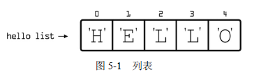

常用的容器：列表、元组和字典。

#### 5.2 列表

列表（list）是以固定顺序保存对象的容器。

列表用方括号表示。

列表可以保存任意数据类型。

列表中第一个元素的索引是0。



```python
x = ["lin","wen","hai"]
x.append("xin")     #append方法，列表末尾添加元素
print(x)
x[2]="an"           #替换列表元素
print(x)
x.pop()             #pop方法，删除列表末尾元素
print(x)
y = "lin"
print(y in x)       #in方法，检查元素是否在列表
```

```python
#用户猜颜色
colors = ["purple","orange","green"]
guess = input("Guess a color: ")
if guess in colors:
    print("you guessed correctly!")
else:
    print("wrong! try again.")
```


#### 5.3 元组

元组（tuple）是存储有序对象的一种容器。

用圆括号表示元组。

元组是不可变的（immutable）。

```python
x = ("lin","wen","hai")
print(x[2])
print("lin" in x)
```


#### 5.4 字典

字典（dictionary）是另一种用于存储对象的内置容器。

字典是可变的，因此可以向字典中新增键值对。

字典用花括号表示。

```python
x = {"a":"red","b":"yellow"}
print(x)
x ["c"]="green"     #添加键值对
print(x)
print(x["c"])       #查询键值
print("a" in x)     #判断键是否在字典
del x["c"]          #删除键值对
print(x)
```

```python
x = {
    "1":"fun",
    "2":"blue",
    "3":"me",
    "4":"floor",
    "5":"live"
}
n = input("Type a number: ")
if n in x:
    y = x[n]
    print(y)
else:
    print("Not found.")
```


#### 5.5 容器嵌套容器

可以在容器中存储容器。

```python
x = [["lin"],["wen"],["hai"]]
print(x)
```


