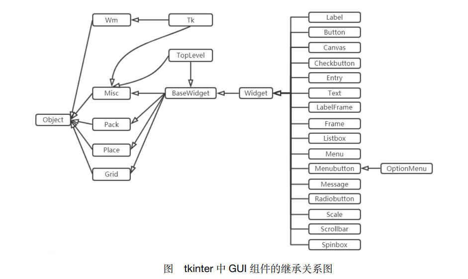
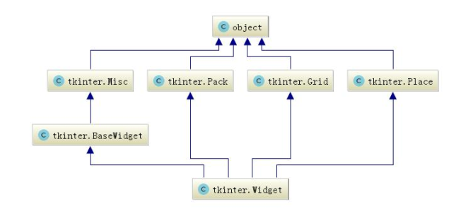

## GUI编程描述

#### 1 Misc和Wm

​	Tkinter 的 GUI 组件有两个根父类， 它们都直接继承了 object 类：

- Misc： 它是所有组件的根父类。
- Wm： 它主要提供了一些与窗口管理器通信的功能函数。  

#### 2 Tk

​	Misc 和 Wm 派生出子类 Tk， 它代表应用程序的主窗口。 一般应用程序都需要直接或间接使用 Tk。  

#### 3  Pack、 Place、 Grid

​	Pack、 Place、 Grid 是布局管理器。布局管理器管理组件的：大小、位置。通过布局管理器可以将容器中的组件实现合理的排布。  

#### 4 BaseWidget 

​	BaseWidget 是所有组件的父类 。

#### 5 Widget

​	Widget 是所有组件类的父类。 Widget 一共有四个父类： BaseWidget、 Pack、 Grid、Place。 意味着， 所有 GUI 组件同时具备这四个父类的属性和方法。  

#### 6 常用组件汇总列表

| Tkinter 类  | 名称       | 简介                                                         |
| ----------- | ---------- | ------------------------------------------------------------ |
| Toplevel    | 顶层       | 容器类，可用于为其他组件提供单独的容器；Toplevel 有点 类似于窗口 |
| Button      | 按钮       | 代表按钮组件                                                 |
| Canvas      | 画布       | 提供绘图功能， 包括直线、 矩形、 椭圆、 多边形、 位图等      |
| Checkbutton | 复选框     | 可供用户勾选的复选框                                         |
| Entry       | 单行输入框 | 用户可输入内容                                               |
| Frame       | 容器       | 用于装载其它 GUI 组件                                        |
| Label       | 标签       | 用于显示不可编辑的文本或图标                                 |
| LabelFrame  | 容器       | 也是容器组件， 类似于 Frame， 但它支持添加标题               |
| Listbox     | 列表框     | 列出多个选项， 供用户选择                                    |
| Menu        | 菜单       | 菜单组件                                                     |
| Menubutton  | 菜单按钮   | 用来包含菜单的按钮（包括下拉式、 层叠式等）                  |
| OptionMenu  | 菜单按钮   | Menubutton 的子类， 也代表菜单按钮， 可通过按钮打开一个 菜单 |
| Message     | 消息框     | 类似于标签， 但可以显示多行文本； 后来当 Label 也能显示多行文本之后， 该组件基本处于废弃状态 |
| PanedWindow | 分区窗口   | 可供用户点边的单选钮                                         |
| Radiobutton | 单选钮     | 可供用户点边的单选钮                                         |
| Scale       | 滚动条     | 拖动滑块可设定起始值和结束值， 可显示当前位置的精确值        |
| Spinbox     | 微调选择器 | 用户可通过该组件的向上、 向下箭头选择不同的值                |
| Scrollbar   | 滚动条     | 用于为组件（文本域、 画布、 列表框、 文本框）提供滚动功能    |
| Text        | 多行文本框 | 显示多行文本                                                 |

