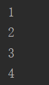
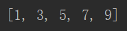
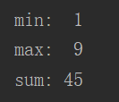
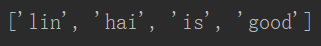

## 函数

#### 11 函数len()

```python
# len()获悉列表的长度
cars = ['bmw', 'audi', 'toyota', 'subaru']
print(len(cars))
```

#### 13 函数range()

```python
# 函数range()从你第一个值开始数,并在到达第二个值后停，不包含第二个值
for value in range(1,5):
    print(value)
```



```python
# 使用range()创建数字列表
x = list(range(1,6))
print(x)
```


```python
# 指定步长
x = list(range(1,11,2))
print(x)
```




```python
# 创建一个列表，其中包含前10个整数（即1~10）的平方
x = []
for y in range(1,11):
    x.append(y**2)
print(x)
```


#### 14 列表统计计算

```python
x = [1,2,3,4,5,6,7,8,9]
print("min: ",min(x))
print("max: ",max(x))
print("sum:",sum(x))
```



#### 3 del语句

```python
# 使用del语句删除元素
name = ['lin','wen','hai','is','good']
del name[1]
print(name)
```




