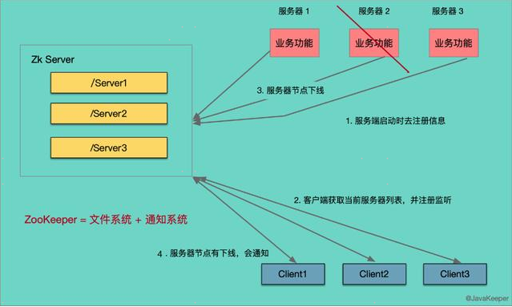
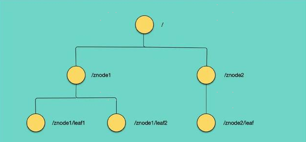
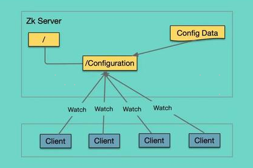
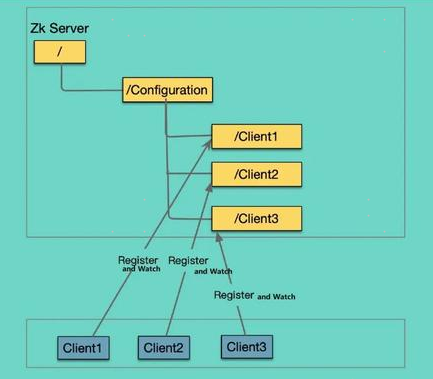
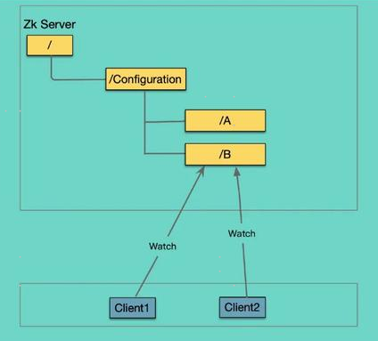
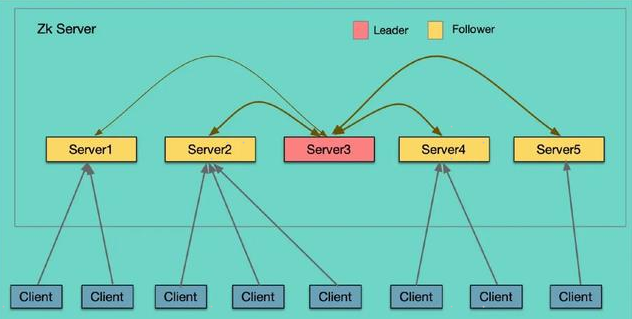
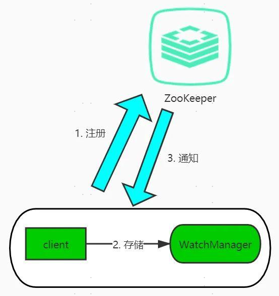

## Zookeeper原理

### 1 ZooKeeper概述

ZooKeeper是一个分布式的，开放源码的分布式应用程序协调服务。是一个为分布式应用提供一致性服务的软件，提供的功能包括：配置维护、域名服务、分布式同步、组服务等。

ZooKeeper工作机制：

### 2 ZooKeeper特性

- 全局数据一致：每个Server保存一份相同的数据副本，Client无论连接到哪个Server，数据都是一致的。
- 顺序一致性：从同一客户端发起的事务请求，最终将会严格地按照顺序被应用到ZooKeeper中去。
- 原子性：所有事务请求的处理结果在整个集群中所有机器上的应用情况是一致的，也就是说，要么整个集群中所有的机器都成功应用了某一个事务，要么都没有应用。
- 实时性：在一定时间范围内，client能读到最新数据。
- 可靠性：一旦一次更改请求被应用，更改的结果就会被持久化，直到被下一次更改覆盖。

### 3 数据结构

Zookeeper数据模型的结构与 Unix 文件系统的结构相似，整体上可以看做是一棵树，每个节点称作一个 ZNode。每个 ZNode 默认能存储 1MB的数据，每个 ZNode 都可以通过其路径唯一标识。

### 4 统一命名服务

在分布式系统中，通过使用命名服务，客户端应用能够根据指定名字来获取资源或服务的地址，提供者等信息。被命名的实体通常可以是集群中的机器，提供的服务地址，进程对象等等——这些我们都可以统称他们为名字（Name）。其中较为常见的就是一些分布式服务框架（如RPC、RMI）中的服务地址列表。通过调用Zookeeper提供的创建节点的API，能够很容易创建一个全局唯一的path，这个path就可以作为一个名称。

阿里巴巴开源的分布式服务框架Dubbo就使用ZooKeeper来作为其命名服务，维护全局的服务地址列表。

### 5 数据发布和订阅

发布者将数据发布到 ZooKeeper 节点上，供订阅者动态获取数据，实现配置信息的集中式管理和动态更新。

例如：全局的配置信息，服务式服务框架的服务地址列表等。

配置管理可交由ZooKeeper实现： 

- 可将配置信息写入ZooKeeper上的一个Znode 。
- 各个节点监听这个Znode 。
- 一旦Znode中的数据被修改，ZooKeeper将通知各个节点。

### 6 集群管理

1】节点管理

可将节点信息写入ZooKeeper上的一个Znode。

监听这个Znode可获取它的实时状态变化。

典型应用：HBase中Master状态监控和选举。

2】master选举

Zookeeper的强一致性，能够很好的保证在分布式高并发情况下节点的创建一定是全局唯一的，即：同时有多个客户端请求创建 Master 节点，最终一定只有一个客户端请求能够创建成功。

Zookeeper通过这种节点唯一的特性，可以创建一个Master节点，其他客户端Watcher监控当前Master是否存活，一旦Master挂了，其他机器再创建这样的一个Master节点，用来重新选举。

### 7 负载均衡

分布式系统中，负载均衡是一种很普遍的技术，为了保证高可用性，通常同一个应用或同一个服务的提供方都会部署多份，达到对等服务。可以是硬件的负载均衡，如 F5，也可以是软件的负载，如Nginx。

**Zookeeper 中，节点分为两类：**

- 第一类同样是指构成集群的机器，我们称之为机器节点；
- 第二类则是指数据模型中的数据单元，我们称之为数据节点ZNode。上图中的 A、B 就是一个数据结点。

**角色：**

- Leader：为客户端提供读和写的服务，负责投票的发起和决议，更新系统状态。
- Follower：为客户端提供读服务，如果是写服务则转发给 Leader，在选举过程中参与投票。
- Observer：为客户端提供读服务器，如果是写服务则转发给 Leader，不参与选举过。

**server状态：**

- LOOKING：寻找Leader状态
- LEADING：领导者状态，表明当前服务器角色是 Leader
- FOLLOWING：跟随者状态，表明当前服务器角色是 Follower
- OBSERVING：观察者状态，表明当前服务器角色是 Observer

### 8 选举机制

- 1】服务器1启动，此时只有它一台服务器启动了，它发出去的报文没有任何响应，所以它的选举状态一直是LOOKING 状态。
- 2】服务器2启动，它与最开始启动的服务器1进行通信，互相交换自己的选举结果，由于两者都没有历史数据，所以id值较大的服务器2胜出，但是由于没有达到超过半数以上的服务器都同意选举它(这个例子中的半数以上是3)，所以服务器1、2还是继续保持 LOOKING 状态。
- 3】服务器3启动，根据前面的理论分析，服务器3成为服务器1、2、3中的老大，而与上面不同的是，此时有三台服务器选举了它，所以它成为了这次选举的Leader。
- 4】服务器4启动，根据前面的分析，理论上服务器4应该是服务器1、2、3、4中最大的，但是由于前面已经有半数以上的服务器选举了服务器3，所以它只能接受当小弟的命了。
- 5】服务器5启动，同4一样当小弟。

### 9 Watcher监听器

监视事件可以理解为一次性的触发器。

Watcher 机制: Zookeeper 允许用户在指定节点上注册一些 Watcher，当 Znode 发生变化时，将触发并删除一个watch。当 watch 被触发时客户端会收到一个数据包，指示 znode 已经被修改。如果客户端和 ZooKeeper 服务器之间的连接中断，客户端将收到本地通知。

ZooKeeper 客户端（Client）会在指定的节点（/Configuration/B）上注册一个 Watcher，ZNode 上的 B 被更新的时候，服务端就会通知 Client1 和 Client2。

Watcher 机制包括三个角色：客户端线程、客户端的 WatchManager 以及 ZooKeeper 服务器。

- 1】客户端向ZooKeeper服务器注册一个Watcher监听。
- 2】把这个监听信息存储到客户端的WatchManager中。
- 3】当ZooKeeper中的节点发生变化时，会通知客户端，客户端会调用相应Watcher对象中的回调方法。